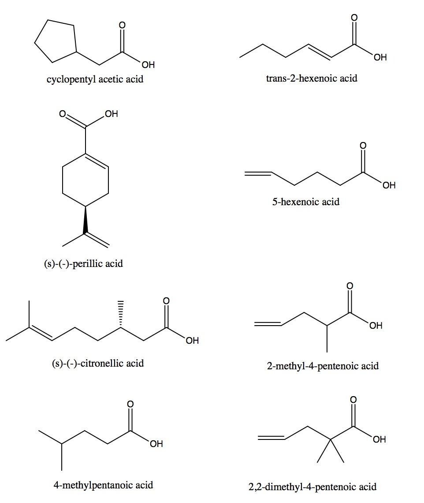
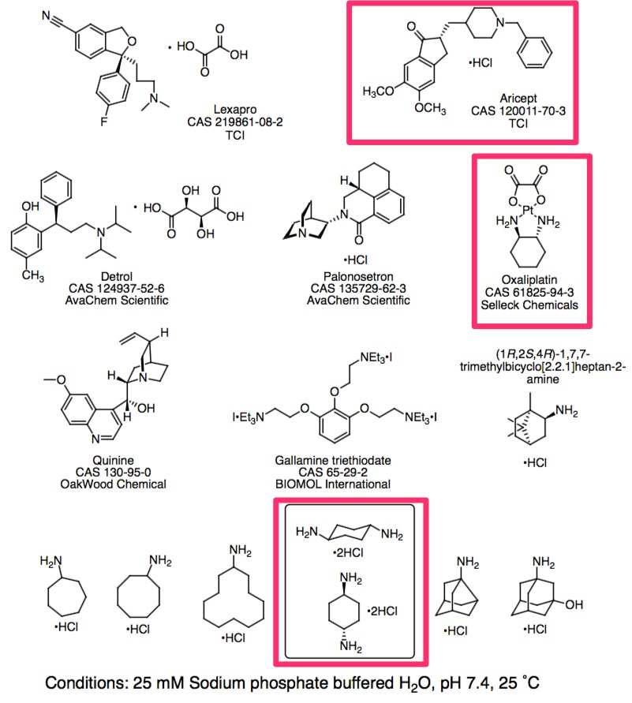

# SAMPL6 Host-Guest Systems and Measurements and Starting Files

This challenge is based on three different hosts, which we are calling octa acid (OA; previously OAH), tetramethyl octa acid (TEMOA; previously OAMe), and CB8, in aqueous solution.
The measurements for these systems were generously carried out specifically for SAMPL6 by Professors Bruce Gibb (Tulane University; OA and TEMOA), and Lyle Isaacs (U. Maryland; CB8).
Data will be provided for one set of 8 guests with both OA and TEMOA, for a total of 16 measurements; and for a different set of ~14 guests for CB8.

The following subsections describe these systems, the experimental conditions and measurements, the quantities to be predicted, and how the molecule and simulation files provided in the download were set up.

## Gibb Deep Cavity Cavitands: OA and TEMOA (OAH and OAMe)
The two host molecules, OA and TEMOA, are closely related to each other; the latter simply has four methyl groups in place of four hydrogens around the portal to the non-polar binding pocket.
This change modifies the shape of the binding cavity.
Host TEMOA is described here: doi:10.1021/ja200633d and host OA is described here doi:10.1007/s10822-013-9690-2.
These will be very familiar to recent SAMPL participants, as they have formed the basis of other SAMPL challenges.
There are also a number of papers from SAMPL4 and SAMPL5 which discuss calculations for this system, as summarized here: doi:10.1007/s10822-014-9735-1 and DOI 10.1007/s10822-016-9974-4.
The previous SAMPL5 challenge used the same two hosts but with a different set of guests.

For the present SAMPL6 challenge, experimental binding data are being measured for the association of the following set of eight guest molecules (Figure below) to both OA and TEMOA.
Some of these compounds have a chiral center; of these, 2-methyl-4-pentenoic acid was measured as a racemic mixture; the other two were enantiopure.
However, because the hosts are both achiral, the handedness of the guests should not affect their affinities.
Thus, valid calculations may be carried out with either form.
The choice should not affecting the computational results or the validity of the comparison with experiment.
However, we have endeavored to provide the correct enantiomer here except for 2-methyl-4-pentenoic acid where one was picked at random.

As of this writing, isothermal titration calorimetry (ITC) measurements have been completed for all guests except 2,2-dimethyl-4-pentenoic acid and the perillic acid.
You may wish to start with the other guests, just in case difficulties are encountered with these two.
If this happens, we plan to substitute other guest molecules.
In all cases, confirmation of the formation of the different 1:1 complexes will be carried out using 1H NMR. 
The thermodynamic parameters (Ka, ΔG˚, ΔH˚ and –TΔS˚) for guest binding will be measured by ITC.
If this proves problematic in any cases, 1H NMR titrations will be used instead to determine the Ka values for guest association.  

The main challenge for this series is to compute the 16 binding free energies (or association constants), and participants are also invited to compute the binding enthalpies.
All measurements are being carried out in aqueous 10 mM sodium phosphate buffer at pH 11.7 ± 0.1, at 298 K.
A review of some of the known challenges in predicting binding to OA/TEMOA is provided at http://github.com/mobleylab/benchmarksets and may be useful.

## Cucurbit[8]uril (CB8)
Cucurbit[8]uril (CB8) is a slightly larger version of the more commonly studied cucurbit[7]uril host.
The CB8 host previously appeared in SAMPL3, as summarized here: doi.org/10.1007/s10822-012-9554-1, and additional information about it may be found in a number of prior publications, including  DOI 10.1021/jp2110067, 10.1002/chem.201403405, and 10.1021/ja055013x.
For the present SAMPL6 challenge, ITC was used to obtain binding free energies and enthalpies for the following 14 guest molecules to this host.
However, not all 14 are being included in the main challenge for reasons discussed below; instead, 11 form the primary challenge, and three are offered as “bonus” cases.

Note that two of the drugs are salts with  tartrate or oxalate counterions, so these ions are in solution during the measurements.
However, experimental evaluation by the Isaacs lab indicates negligible binding of these anions to CB8 under the present conditions.
Compounds listed with no CAS# or source given were purchased as the free base and made into the HCl salts in the Isaacs lab.
It is also worth emphasizing that some of these compounds, particularly quinine, are complex stereochemically.
We have endeavored to provide correct starting structures, but would advise checking our work, and keeping an eye on the stereochemistry during all cheminformatics and modeling steps, to avoid inadvertent changes in stereochemistry.

CB8 has a larger binding cavity than CB7, and there is the possibility of 1:1 and/or 1:2 CB[8]:guest binding.
This has been assessed experimentally and aricept and cyclohexane diamine were found bind in 1:2 complexes, whereas the other compounds do not.
Oxaliplatin is also potentially complex due to the platinum atom it contains.
As a consequence,  these three compounds are not being included in our main challenge.
Accordingly, the **main challenge** is to compute the 11 binding free energies (or association constants) of the remaining compounds with CB8, and participants are also invited to compute the binding enthalpies.
A **bonus challenge** is to also predict binding affinities for aricept, cyclohexane diamine, and oxaliplatin (highlighted in magenta in the image).
All measurements were carried out in aqueous 20 mM sodium phosphate buffer at pH 7.2, at 298 K.
Measurements are currently complete for all compounds shown, except Detrol and gallamine triethiodate.
You may wish to do these last, just in case unexpected difficulties are encountered for these last two.
We will let you know of any updates regarding the experimental work (assuming you either sign up for the SAMPL e-mail list or monitor this GitHub repository).

Previous studies of CB7 have revealed that salt concentration can strongly influence both measured and computed binding free energies; e.g. see review in https://github.com/MobleyLab/benchmarksets, and it seems likely that this will also hold for  for CB8.

