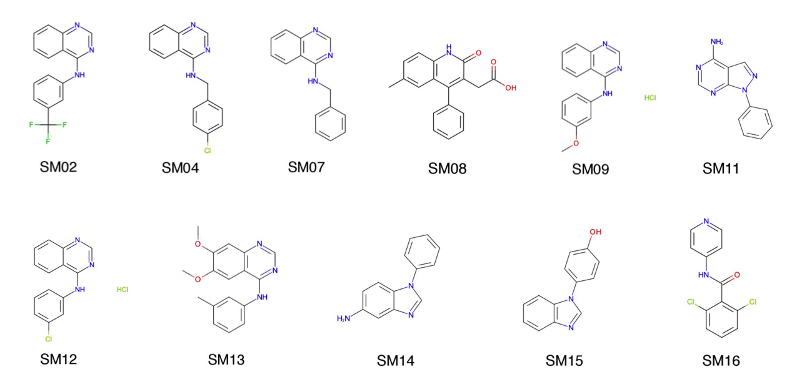
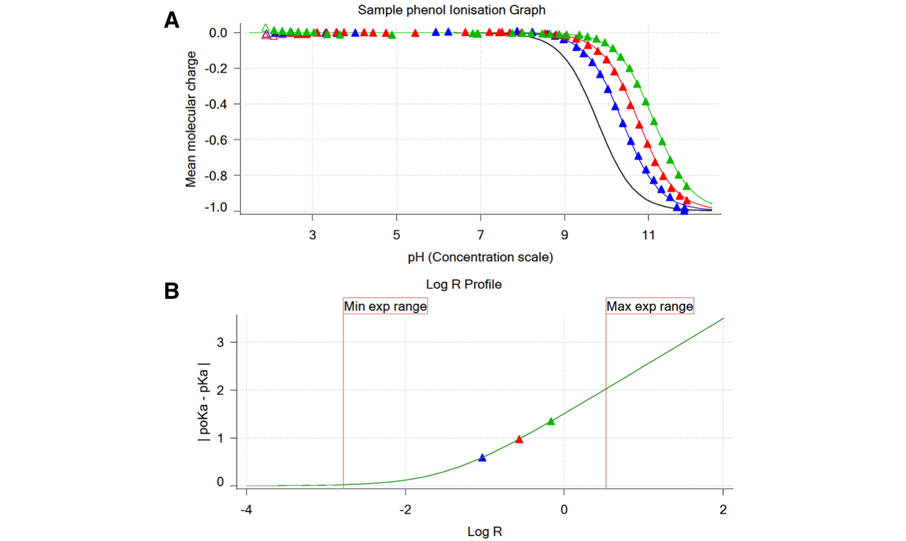

# SAMPL6 log *P* Challenge Instructions

SAMPL6 was originally announced as featuring a log *D* prediction challenge, but there were difficulties in the collection of experimental data as we explain in “Experimental Details” section below. 
We were instead able to collect experimental neutral-compound log partition coefficients (log *P*) for a subset of the SAMPL6 pKa challenge compounds. 
Thus, these form the basis of  SAMPL6 Part II -- a log *P* prediction challenge commencing immediately. 
We hope that the log *P* challenge will be useful in investigating sources of modeling errors that impact solvation, partition, and affinity predictions other than protonation state related errors that were prominent in SAMPL5 log *D* challenge.  

This challenge consists of predicting the octanol-water partition coefficients (log *P*) of 11 small molecules that resemble fragments of small molecule protein kinase inhibitors. 
Our aim is to evaluate how well current models can capture the transfer free energy of small molecules between different solvent environments through blind predictions.

log *P*oct/wat = log10 ( [unionized solute]octanol / [unionized solute]water ) 

Participants are encouraged to submit articles evaluating their methods to the coming special issue or section of the Journal of Computer-Aided Molecular Design special issue targeting September 2019. 
The challenge will culminate with a joint D3R/SAMPL workshop.
The following subsections describe the molecules included in this challenge, the experimental conditions and measurements, the quantities to be predicted, and how prediction results must be submitted.

## Challenge Timeline

- Nov 1, 2018  -  SAMPL6 Part II Challenge start date
- Mar 15, 2019  -  Challenge submissions due 
- Mar 18, 2019  -  Experimental data release date 
- May 16, 2019  -  SAMPL6 log *P* challenge virtual workshop
- Aug 22-23, 2019  -  Joint D3R/SAMPL workshop, San Diego 
- Sep 15, 2019  -  JCAMD special issue submissions due 

Your predictions must be uploaded on the [D3R SAMPL6 web-page](https://drugdesigndata.org/about/sampl6) by March 15th, 2019. 
The experimental results will be released immediately after the challenge closes. 

# Motivation

Distribution coefficients (log *D*) replaced hydration free energies in SAMPL5 challenge and provided great insight into the importance of modeling a variety of physical effects (overview doi:10.1007/s10822-016-9954-8 and experiment doi:10.1007/s10822-016-9971-7; JCAMD special issue https://link.springer.com/journal/10822/30/11/page/1). 
log *D* values capture the same properties as hydration free energies, namely, solvation in the respective solvents. 
In many SAMPL5 submissions, they were predicted as if they were partition coefficients (log *P*). 
The difference between log *D* (which reflects the transfer free energy at a given pH including the effects of accessing all equilibrium protonation states of the solute in each phase) and log *P* (which reflects the free energy of transfer for the neutral form only) proved particularly important. 
In some cases, other effects like the presence of a small amount of water in cyclohexane may also have played a role.

Because the SAMPL5 log *D* challenge highlighted the difficulty in correctly predicting transfer free energies involving protonation states (the best methods with RMSE of 2.5 log units [1]), we aimed to isolate the protonation and partition prediction components into two different challenges in SAMPL6. 
Participants are asked to predict the partition coefficient log *P* of the neutral species between octanol and water phases.

Partition coefficient prediction as a model problem embodies important elements of the physical chemistry of protein-ligand binding affinity prediction, while making it far easier to probe the accuracy of computational tools used to model protein-ligand interactions and to identify and correct sources of error. 
For physical modeling approaches, evaluation of partition coefficient predictions is a means of separating force field accuracy from sampling and protonation state modeling challenges. Protein-ligand binding equilibrium is like a partitioning between two environments: protein binding site and aqueous phase. 
Methods that employ thermodynamic cycles, such as free energy calculations, can therefore employ similar strategies as they would for calculating binding affinities.  
On the other hand, partition coefficient prediction omits the difficulties of conformational sampling of proteins and treatment of protonation states. 

We believe SAMPL6 logP challenge will benefit improvement of solvation, partition/distribution coefficient and affinity prediction methods, as well as other components of molecular modeling methods such as force fields, sampling algorithms, and prediction of prospective model inaccuracies. 
One of the goals of this challenge is to encourage prediction of model uncertainties (an estimate of the inaccuracy with which your model predicts the physical property), since the ability to tell when methods will be successful or not would be very useful for increasing the application potential and impact of computational methods.

## 11 small molecules are included in log *P* challenge

**Fig 1. SAMPL6 logP Challenge molecules.** These molecules are a subset of the SAMPL6 pKa Challenge set. 

The SAMPL6 log *P* prediction challenge is composed of a subset of kinase inhibitor fragment-like small molecules from SAMPL6 pKa challenge. We kept the Molecule IDs assigned to these molecules for the pKa challenge. 
These 11 small molecules were selected due to their suitability for potentiometric log *P* measurements. 
Six of them represent the 4-amino quinazoline scaffold. 

A list of SAMPL6 log *P* Challenge small molecules, isomeric SMILES, and molecule IDs can be found here: [`/physical_properties/logP/molecule_ID_and_SMILES.csv`](/physical_properties/logP/molecule_ID_and_SMILES.csv). 
Counterions, where present in solid formulations (see Experimental Details section below), were included in canonical isomeric SMILES for the sake of completeness, although no significant effect is expected from the presence of chloride counterions as experiments were conducted in ionic-strength adjusted medium with KCl.

## Experimental details

Experimental log *P* values were collected using potentiometric log *P* (pH-metric log *P*)[2] measurements with a [Sirius T3 instrument (Pion)](http://www.sirius-analytical.com/products/t3) by Mehtap Isik from the Chodera Lab at MSKCC with the support of the Preformulation Group, Pharmaceutical Sciences, MRL, Merck & Co., Inc, especially Dorothy Levorse, Timothy Rhodes, and Brad Sherborne.

The pH-metric log *P* measurement method of the Sirius T3 instrument [3-6] is based on determining a lipophilicity profile directly from acid-base titrations in a dual-phase water-partition solvent system. 
In this method, multiple potentiometric acid-base titrations are performed in the presence of different ratios of octanol and water to observe the ionization and partitioning behavior of the analyte. A
s the relative volume ratio of octanol to water changes, a shift in apparent pKa (poKa) is observed due to partitioning to the octanol phase. 
Equations of partitioning and ionization are solved to determine the log *P* of the neutral and ionic species. 
To use this method, aqueous pKa value(s) must be known and analytes must be sufficiently water soluble.

Aqueous pKa values of log *P* challenge compounds were previously determined using UV-metric measurements with the Sirius T3, as described in [the SAMPL6 pKa challenge](physical_properties/pKa/). 
These values were used as input for pH-metric log *P* measurements. 
Unfortunately, only 11 of 24 compounds of pKa challenge set were found to be suitable for pH-metric log *P* measurements.

Three independent replicates of log *P* measurements in 1-octanol and water biphasic systems were performed at 25°C. 
Samples were prepared by weighing 1-3 mg of analyte in solid powder form into glass vials. 
The weights of analytes were inputted to the analysis software. 
The rest of the sample preparation was controlled by the automated titrator: addition of ionic-strength adjusted (ISA) water and partition solvent, mixing, and sonication. 
ISA water is 0.15 M KCl solution which was used to keep ionic strength constant during the experiment. 
Partition solvent is 1-octanol saturated with ISA water, which was prepared as a 5% ISA water-octanol mixture (by volume) and letting the mixture phases separate. 
In some cases to help with kinetic solubility issues of the analytes, solid samples were predosed manually with 80-100 uL octanol before the addition of ISA water and partition solvent.

**Fig 2. Mean molecular charge profiles of pH-metric titrations for log *P* measurement of a monoprotic base [2].**
Green curve represents the predicted ionization profile in aqueous solution (without octanol) calculated based on experimental pKa. 
Blue curves are titration curves shifted in the presence of different amounts of octanol. 
pKa or poKa are determined as the pH value at which half-maximum point of mean molecular charge is reached. 
Water-octanol volume ratios of three titrations need to be selected so that they lead to distinct poKa values for an accurate determination of log *P*. 
**(A)** Modelled ionization profile of a good experiment with well separated poKa values. 
**(B)** An experiment with overlapping poKa values. 
It is necessary in case **(B)** to adjust the octanol-water ratios for better, more resolved log *P* measurements. 

For each replicate of log *P* measurement, three sequential automated acid-base titrations were performed at three different volume ratios of octanol and water, using 0.5 M KOH and HCl titrants while monitoring pH with a pH electrode. 
Additional octanol volumes were dispensed before each titration to achieve target octanol-water ratios. 
Experiments were designed so that the total volume in the analysis vial did not exceed 3 mL by the end of three titrations. 

When an ionizable substance is titrated in a two-phase system, the apparent pKa observed in the titration shifts due to differential partitioning of neutral and ionized species into the nonaqueous phase. 
The poKa value is the apparent pKa in the presence of octanol and it is dependent on the ratio of the water and octanol phases. 
The poKa shifts up with monoprotic acids and down with monoprotic bases. 
The shift in poKa is directly proportional to the log *P* of the compound and the ratio of octanol to water. 
For a monoprotic base, partition coefficient of neutral species (P0) relates to pKa and poKa as follows, where r is the volume ratio of nonaqueous phase to aqueous phase [2]:

Analysis of experimental data was performed with the Sirius T3 Refinement Software. 
First, simulated titration curves were constructed using aqueous pKa values, predicted log *P* values, input analyte concentration, and volumes of aqueous and organic phases. 
Collected experimental data points were used to refine the model parameters (logP of neutral species, log *P* of ionic species, analyte concentration factor, carbonate content, acidity error) to determine the log *P* values of neutral species and ions [5]. 
pH-metric log *P* measurements have the potential to determine partition coefficient of the ions (log *P*1) in addition to logP of neutral species (log *P*0). 
It was however very challenging to design experiments to capture log *P*1 values due to volumetric limitations and potentially large shifts that may move poKa values out of the measurable pH range (2-12). 
Therefore, we designed the experiments to capture only the partition coefficient of neutral species (log *P*0) accurately. The SAMPL6 log *P* prediction challenge will only involve prediction of neutral species. 
Experimental protocols were optimized iteratively by adjusting octanol-water ratios, analyte concentration, and pH interval of the titration.  

An example of pH-metric log *P* determination results is shown in **Figure 3** for phenol (which is not part of the prediction challenge). The report of phenol log *P* measurement can be found in [/physical_properties/logP/example_experimental_data](/physical_properties/logP/example_experimental_data) directory.

**Fig 3.** Illustration of octanol-water log *P* measurement of phenol (log *P*=1.49) using the pH-metric log *P* method of the Sirius T3. Since phenol is a monoprotic acid, octanol partitioning causes higher poKa values than aqueous pKa. 
**(A)** Triangles represent experimental data points collected during the octanol-ISA water titrations and solid lines represent the ionization and partitioning model fit to the data. 
The black line is the titration curve in aqueous media without octanol and based on the aqueous pKa. 
Blue, red, and green triangles represent three sequential titrations with increasing logR (log10 of octanol to water volumetric ratio) that show shifted poKa values. 
**(B)** Inspection of the logR profile aids experimental design to achieve 3 data points with well separated poKa values by adjusting the octanol-water ratios.

We attempted measuring the log *P* for all 24 SAMPL6 pKa challenge compounds, but the pH-metric log *P* measurement method was suitable for only a subset of 11 molecules which were included in the study. 
Potential factors limiting the log *P* measurement of more molecules were low water solubility within the pH range of titration, limitation of total sample volume that restricts range of achievable octanol and water ratios, poKa values shifting out of the measurable pH range of 2-12 (especially high acidic pKas and low basic pKas), and log *P* values out of the dynamic range of the experimental methodology. 
We only included small molecules with high quality pH-metric log *P* measurements in this challenge.

