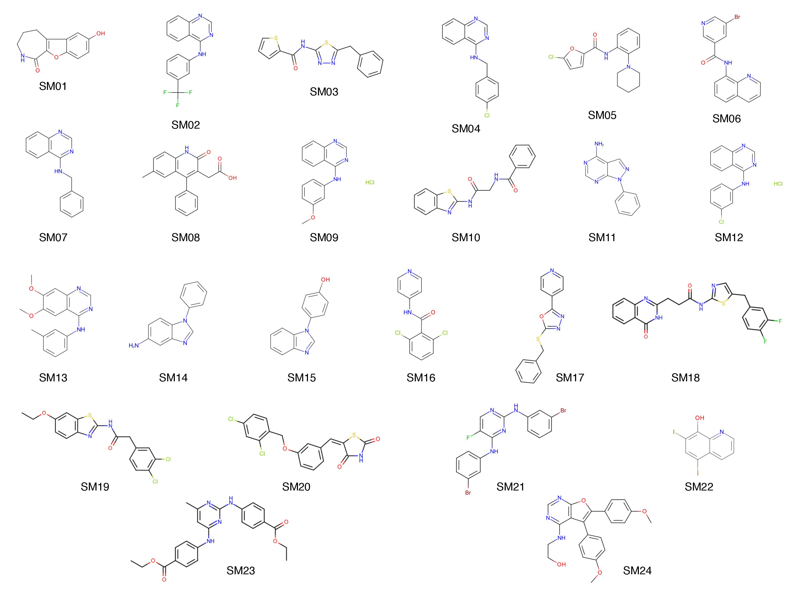

# SAMPL6 pKa Challenge Instructions

Challenge timeframe: Oct 24, 2017 to Jan 10, 2018
This challenge consists of predicting microscopic and macroscopic pKas of 24 small organic molecules. These fragment-like small molecules are selected for their similarity to kinase inhibitors and for experimental tractability. Our aim is to evaluate how well current pKa prediction methods perform with drug fragment-like molecules through blind predictions.

The following subsections describe the molecules included in this challenge, the experimental conditions and measurements, the quantities to be predicted, and how prediction results must be submitted.

## Small molecules included in the pKa challenge

A list of SAMPL6 pKa challenge small molecules canonical isomeric SMILES and molecule IDs can be found [here](physical_properties/pKa/molecule_ID_and_SMILES.csv).

## Experimental details
pKa measurements were collected using spectrophotometric pKa measurements with Sirius T3 instrument by Mehtap Isik from Chodera Lab with the support of Merck Rahway, Preformulation Department. 

Small molecules were purchased in powder form. 10 mg/ml DMSO solutions were prepared and used as stock solutions for preparation of samples, where 1-5 uL of 10 mg/ml DMSO stock solution is diluted in 1.5 mL ionic-strength adjusted water (0.15 M KCl).  

[UV-metric pKa measurement protocol of Sirius T3](http://www.sirius-analytical.com/science/pka) evaluates pKas based on change of absorbance in the UV region of the spectrum while a pH titration is being performed between pH 1.8 and 12.2. UV-absorbance spectra of small molecule chromophores can change as a function of pH,  based on the protonation state change of groups close to the chromophore. Change in multiple wavelengths as a function of pH is fitted to a model to determine pKas. Number of pKas in the model is selected based on better with to experimental data. This method is capable of measuring pKas between 2 and 12.

pKa measurements of soluble compounds were performed in ionic-strength adjusted water with 0.15 M KCl. For compounds with insufficient solubility, cosolvent protocol is used where 3 UV-metric pKa measurements were done at different cosolvent:water ratios (typically 30%, 40% and 50% methanol) and  Yasuda-Shedlovsky extrapolation method is used to estimate pKa value at 0% cosolvent.

Three independent replicate measurements were made for all compounds at room temperature (25°C). Multiwavelength absorbance analysis of Sirius T3 allows very good resolution pKas but essentially this method measures macroscopic pKas. Microscopic pKas with with very close pKa values and overlapping changes in absorbance spectra could be measured as one macroscopic pKa value.

## pKa Predictions and Submission Instructions
Three types of predictions will be accepted. Participants are encouraged to submit their results in all or multiple submission types as it fits to their prediction methods.

Type I - microscopic pKas and related microstates
Predicting microscopic pKa values and related microstates structures. Different protonation states and tautomers constitute different microstates. 

Type II - microstate populations as a function of pH
Predicting fractional population of microstates between pH interval 2 to 12 with 0.1 pH increments, based on microscopic pKa predictions.

Type III - macroscopic pKas
Predicting the value of  macroscopic pKas based between 2 and 12.

